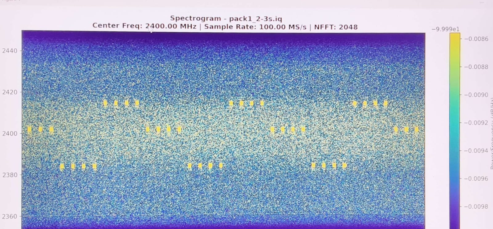
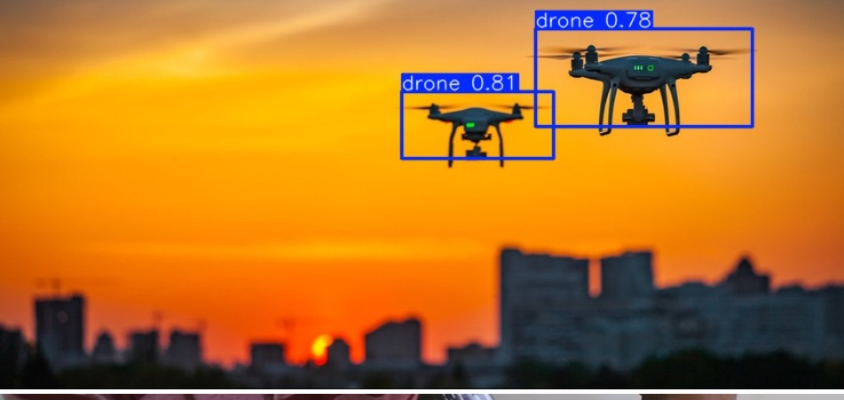
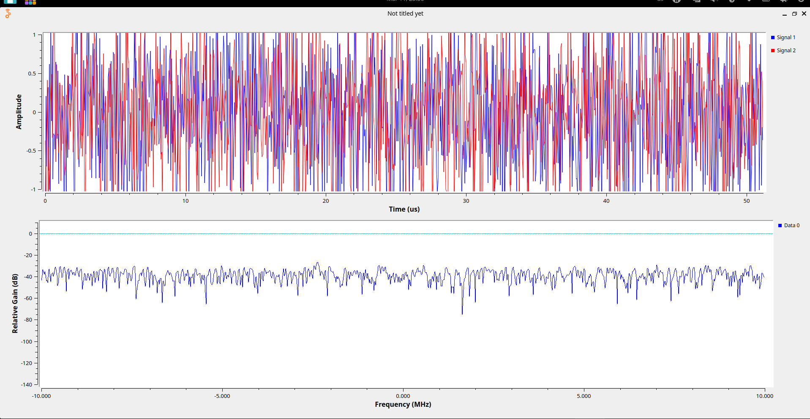

# Anti-Drone System (Proof of Concept)

## Background

The **Indo-Tibetan Border Police (ITBP)** operates in **high-altitude, remote terrain** along the Indo-China border, where extreme conditions degrade both **human** and **equipment** performance.  
These regions are vulnerable to **enemy drone intrusions**, requiring a **counter-drone solution** for **early detection** and **soft-kill neutralization** (jamming & spoofing) within a safe operational radius.


## Problem Statement

A **portable anti-drone system** with **detection, jamming, and spoofing** modules to counter **single and swarm drone threats** from multiple directions.

| Capability | Range |
|---|---|
| Detection (Micro/Small) | **≥ 5 km** |
| Detection (Medium) | **≥ 10 km** |
| Jamming (Omni / Directional) | **≥ 3 km / ≥ 4 km** |
| Spoofing (Omni / Directional) | **≥ 20 km / ≥ 40 km** |


## Competition Context

This project was developed as part of the **Smart India Hackathon (SIH)**, focusing on **defence and national security applications**.  
The aim was to design and demonstrate a **feasible, modular, and scalable counter-drone architecture**, emphasizing **concept validation and system integration** rather than full-scale deployment.

---

## Project Scope

⚠️ **Important Note:**  
This system is a **Proof of Concept (PoC)** implementation of the above problem statement.

- Demonstrates **core principles** of detection, jamming, and spoofing  
- Validates feasibility at **prototype and simulation level**  
- Does **not claim to achieve operational field ranges** mentioned in the problem statement  
- Designed for **academic, research, and controlled testing environments**


#### The repository is divided into 4 main components :

---

## [Drone Detection](https://github.com/badboy1606/anti_drone/tree/main/drone_detection)

Drone detection is performed using **Software Defined Radio (SDR)** techniques with **HackRF**, focusing on identifying RF activity associated with drone communication and control links.

<p align="center">
  
</p>


## [Drone tracking](https://github.com/badboy1606/anti_drone/tree/main/drone_tracking)

This is done using YOLO for the detection of drone and making a 2 DOF appratus which will be used for tracking purpose

<p align="center">
  
</p>


## [Jamming](https://github.com/badboy1606/anti_drone/tree/main/Jamming)

The jamming module explores **soft-kill techniques** to disrupt drone control and navigation links by transmitting interference signals on targeted frequency bands.
<p align="center">
  
</p>


## [Spoofing](https://github.com/badboy1606/anti_drone/tree/main/Spoofing)

The spoofing module demonstrates a **prototype GNSS spoofing mechanism** using ESP32 microcontrollers, highlighting vulnerabilities in unauthenticated navigation systems by transmitting false but valid-looking coordinate data.

## Usage

To clone and try out stuff the project: 

```
git clone https://github.com/badboy1606/anti_drone.git
```
Software and components Required

- GNU Radio
- HackRF One

--- 

### Connect with us 
- [Arhan Chavare](https://www.linkedin.com/in/arhan-chavare-5a23a8334/)
- [Sahil Apage](https://www.linkedin.com/in/sahilapage/)
- [Lakshya Lalwani]( https://www.linkedin.com/in/lakshya-lalwani-32a35b259/)
- [Harshit Bhalani](https://www.linkedin.com/in/harshit-vinod-bhalani-597640323/)
- [Janhvi Mokal](https://www.linkedin.com/in/janhavi-mokal-9b1706328/)
- [Rayon Biswas](https://www.linkedin.com/in/rayon-biswas-309b78346/)